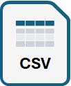

## Simulation Data

This page contains data for some simulations done with the room.

### Observation Data
Observation data covers the temperatures of the environment and the room together with the opening of the window and whether the radiator is on or off.
Check also the [resulting diagrams](../../Illustrations/Diagrams/#additional-observation-diagrams).

Complete week 2022, April 22-28

Daily diagrams 2022, April 22-28

Complete week 2023, April 22-28

Daily diagrams 2023, April 22-28

### SLX Simulation Data
Simulation data covers the observation and, in addition, the boiler and radiator temperatures, the radiator target temperature, and the opening of the radiator valve.
Check also the [resulting diagrams](../../Illustrations/Diagrams/#additional-slx-simulation-diagrams).

Complete week 2022, April 22-28

Daily diagrams 2022, April 22-28

Complete week 2023, April 22-28

Daily diagrams 2023, April 22-28

