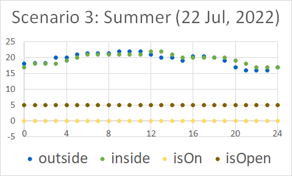
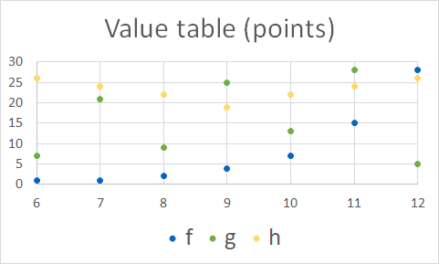

## Diagrams

This page contains diagrams related to the book, both the diagrams contained in the book and more simulation diagrams.

### Diagrams from Book
You can see their Figure number in the book by hovering over them.

### Additional Observation Diagrams
Complete week 2022, April 22-28

Daily diagrams 2022, April 22-28

Complete week 2023, April 22-28

Daily diagrams 2023, April 22-28

### Additional SLX Simulation Diagrams
Complete week 2022, April 22-28

Daily diagrams 2022, April 22-28

Complete week 2023, April 22-28

Daily diagrams 2023, April 22-28

