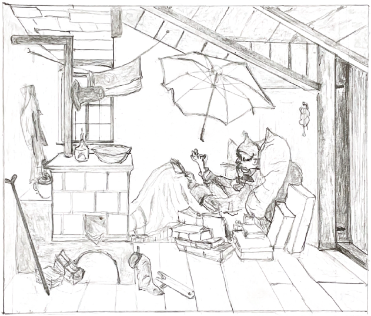

## Drawings

Here we have collected the drawings of the book. You can see their Figure number in the book by hovering over them.
They are all copyright Joachim Fischer.
Find the other Figures of the book under [figures](../Figures), [diagrams](../Diagrams), or [SysML](../../ModelDescriptions/RoomModelSysML).

