## Figures

Here we have collected the Figures of the book. You can see their number in the book by hovering over them.
Some of the figures can be found under [drawings](../Drawings), [diagrams](../Diagrams), or [SysML](../../ModelDescriptions/RoomModelSysML).

### Figures from Chapter 2

[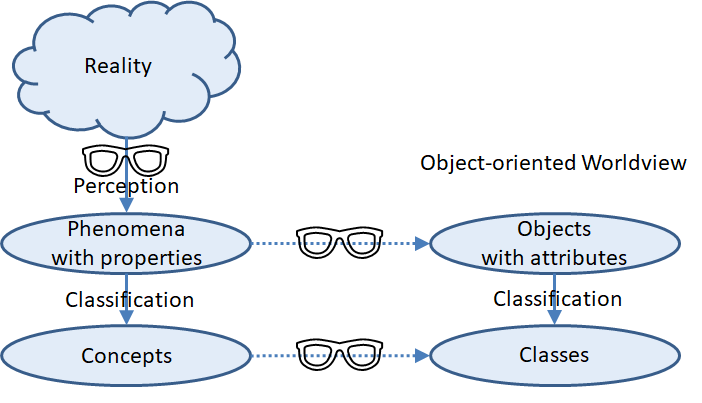](Figure_2_2.png)
[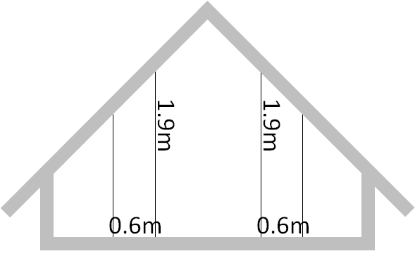](Figure_2_3a.png)
[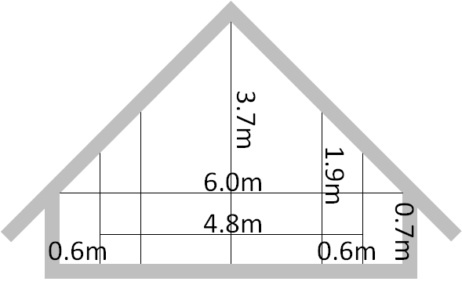](Figure_2_3b.png)
[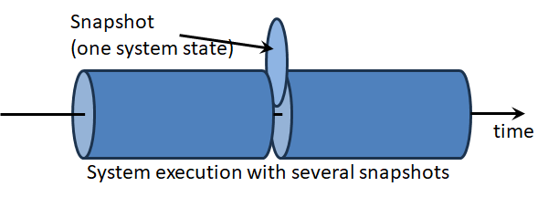](Figure_2_4.png)
[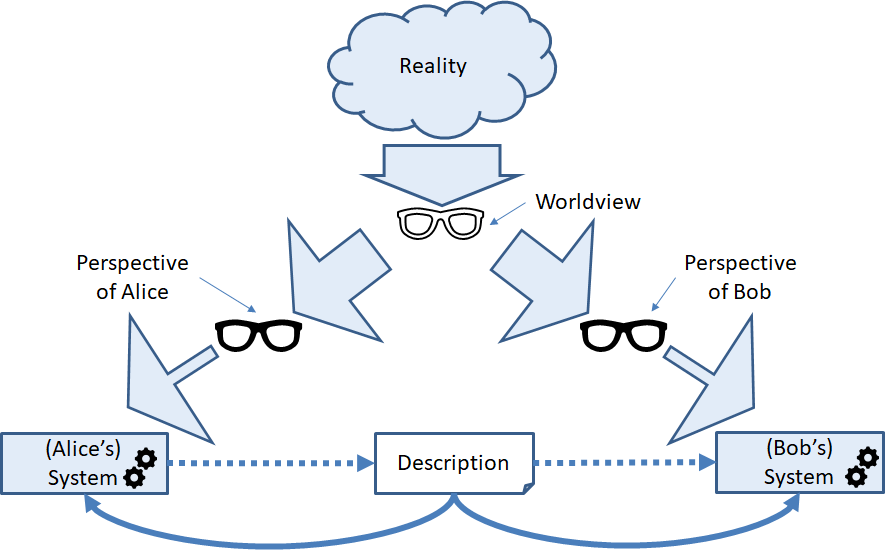](Figure_2_6.png)
[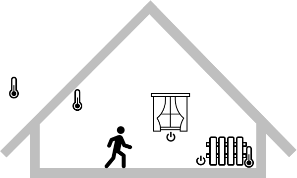](Figure_2_8.png)
[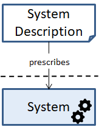](Figure_2_12.png)
[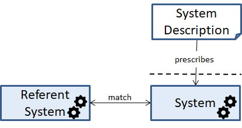](Figure_2_13.png)

### Figures from Chapter 3
[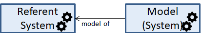](Figure_3_1.png)
[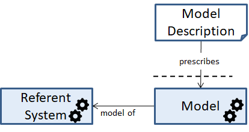](Figure_3_2.png)
[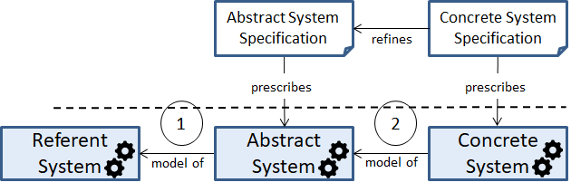](Figure_3_5.png)
[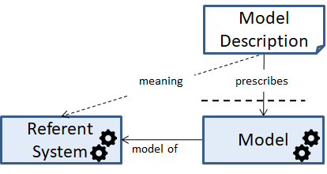](Figure_3_6.png)
[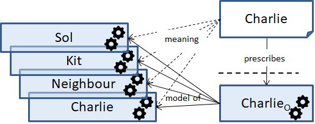](Figure_3_8.png)

### Figures from Chapter 4
[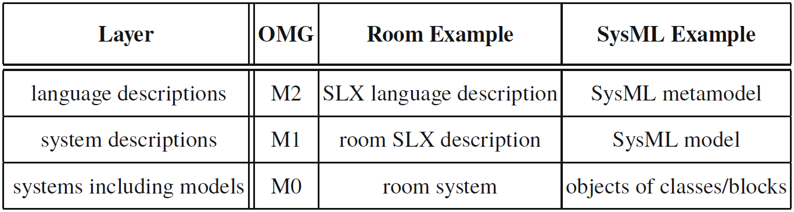](Figure_4_1.png)

### Figures from Chapter 5

[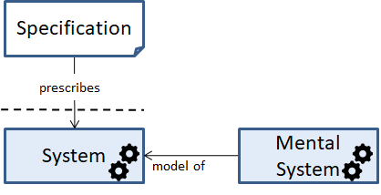](Figure_5_2.png)
[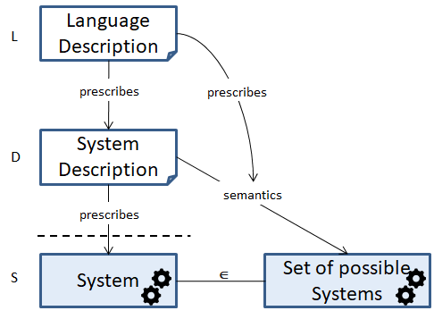](Figure_5_3.png)
[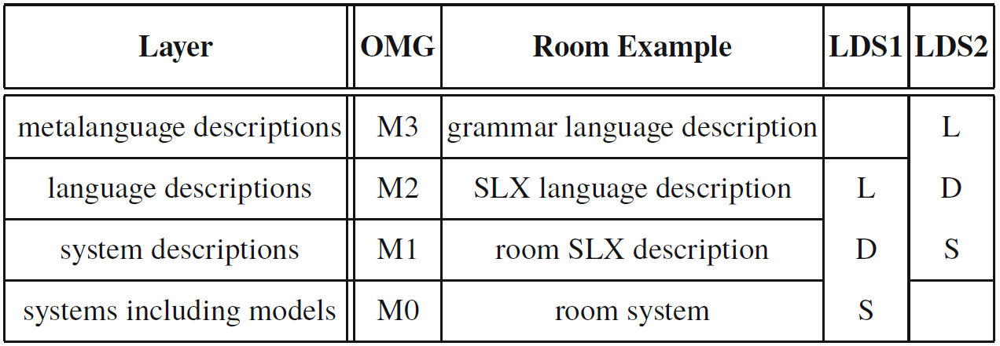](Figure_5_4.png)
[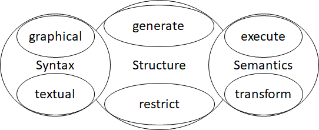](Figure_5_5.png)
[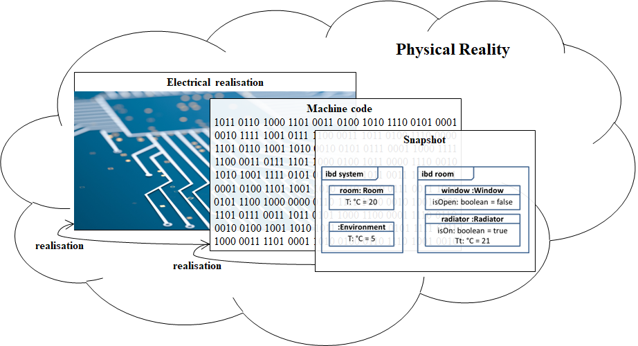](Figure_5_6.png)
[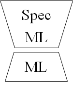](Figure_5_8.png)
[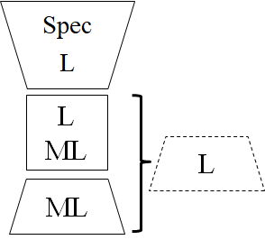](Figure_5_9.png)
[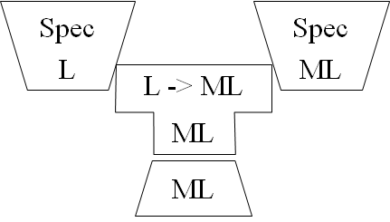](Figure_5_10.png)
[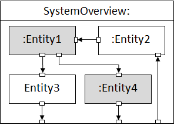](Figure_5_11.png)
[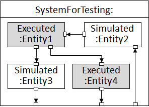](Figure_5_12a.png)
[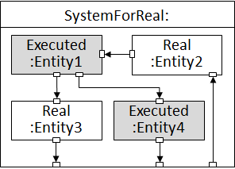](Figure_5_12b.png)

### Figures from Chapter 6
[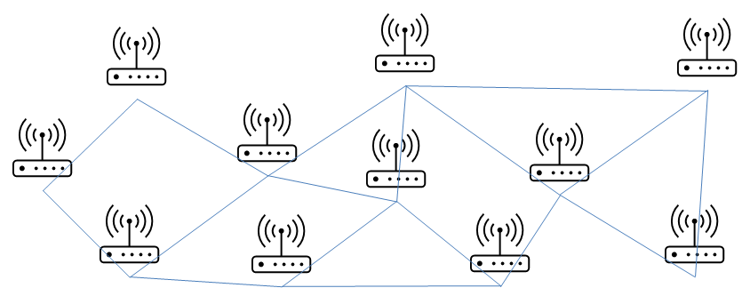](Figure_6_2.png)

[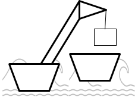](Figure_6_4b.png)
[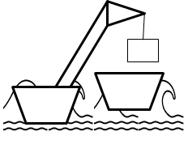](Figure_6_4c.png)
[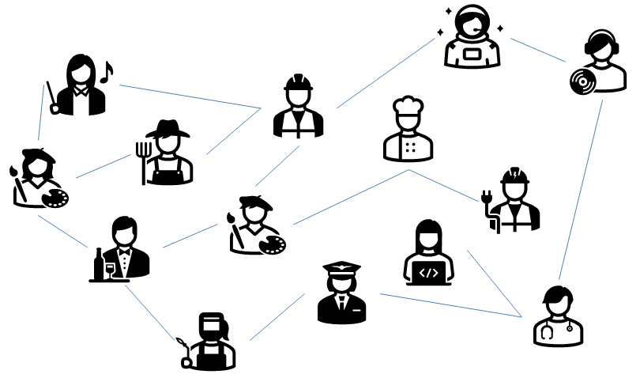](Figure_6_6a.png)
[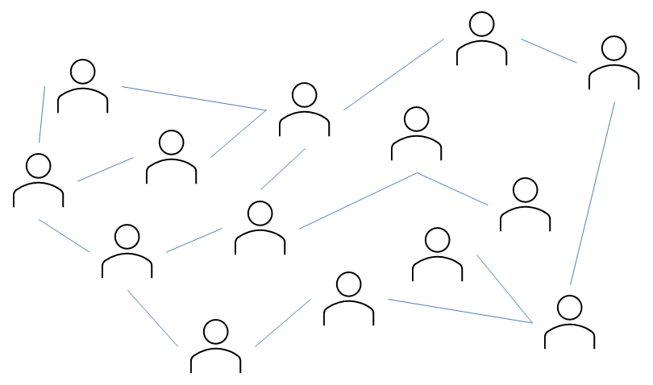](Figure_6_6b.png)

[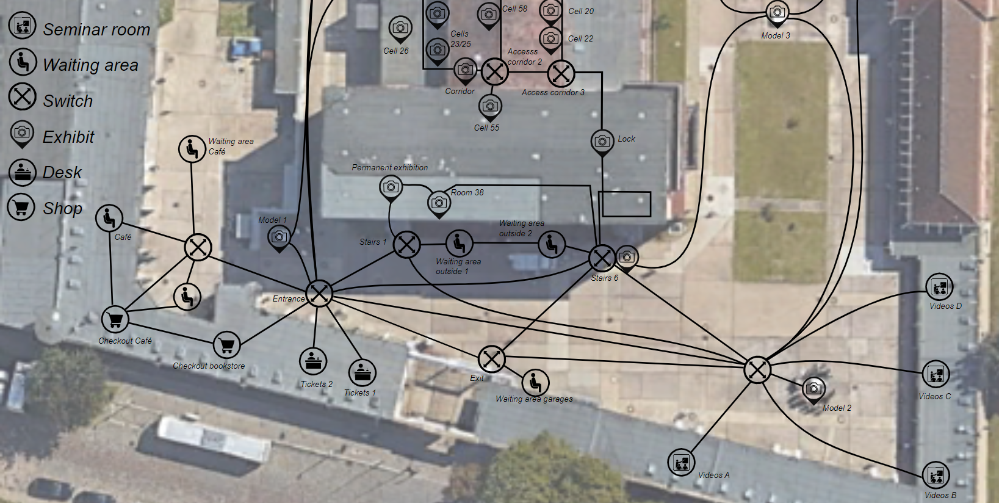](Figure_6_10.png)

### Figures from Chapter 7
[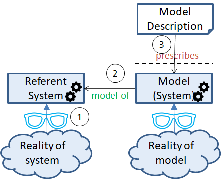](Figure_7_1.png)
