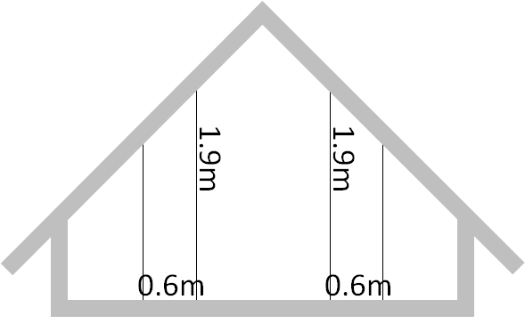

## Figures

Here we have collected the Figures of the book. You can see their number in the book by hovering over them.
Some of the figures can be found under [drawings](../Drawings), [diagrams](../Diagrams), or [SysML](../../ModelDescriptions/RoomModelSysML).

* Work in progress

* Figures 
<figure>
  
  <figcaption>Figure xab</figcaption>
</figure>
<a href="BRA.png"><figure>
  
  <figcaption>Figure xab</figcaption>
</figure></a>

