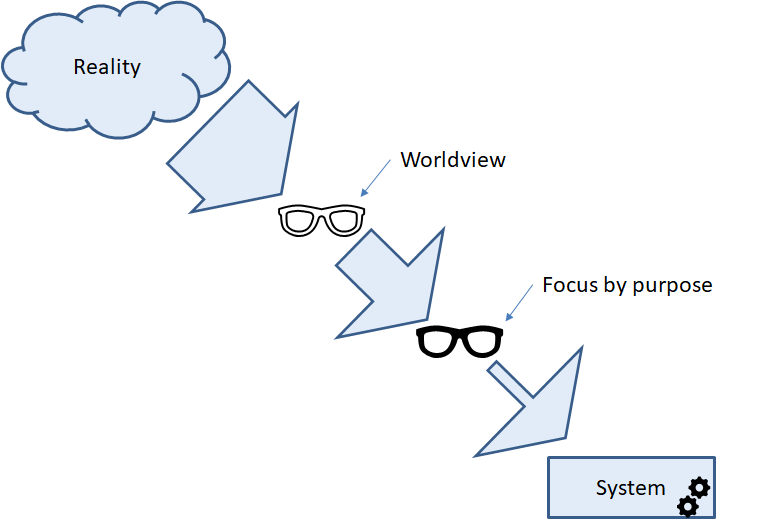
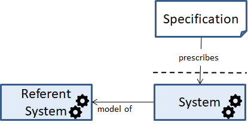
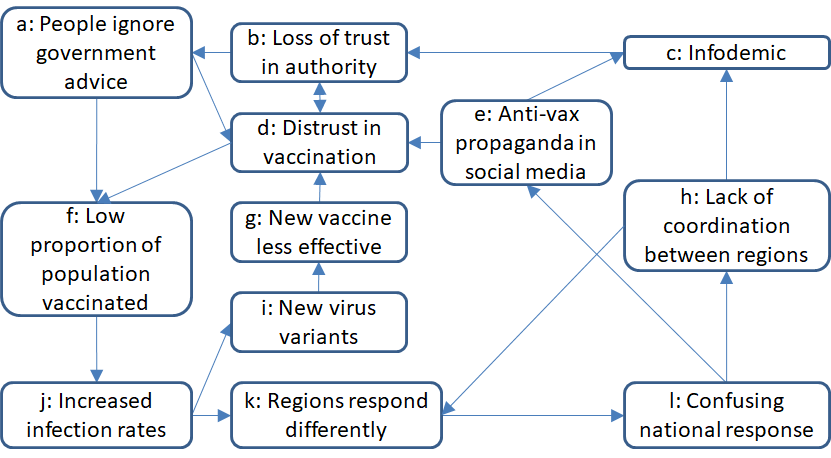

## Figures

Here we have collected the Figures of the book. You can see their number in the book by hovering over them.
Some of the figures can be found under [drawings](../Drawings), [diagrams](../Diagrams), or [SysML](../../ModelDescriptions/RoomModelSysML).

### Figures from Chapter 2

### Figures from Chapter 3

### Figures from Chapter 4

### Figures from Chapter 5

### Figures from Chapter 6

### Figures from Chapter 7

