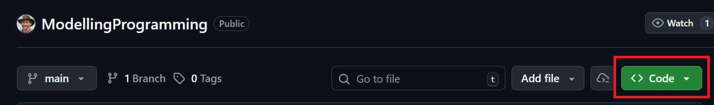
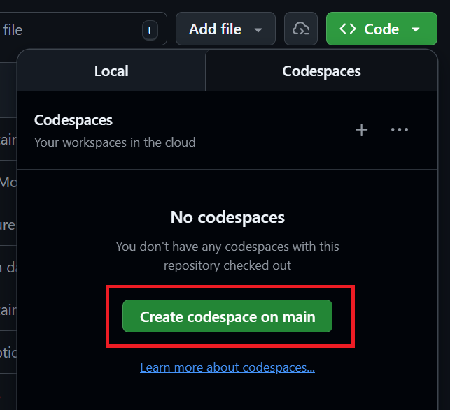
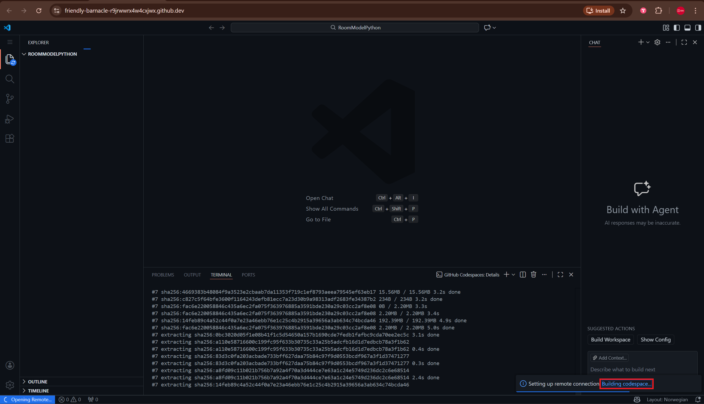
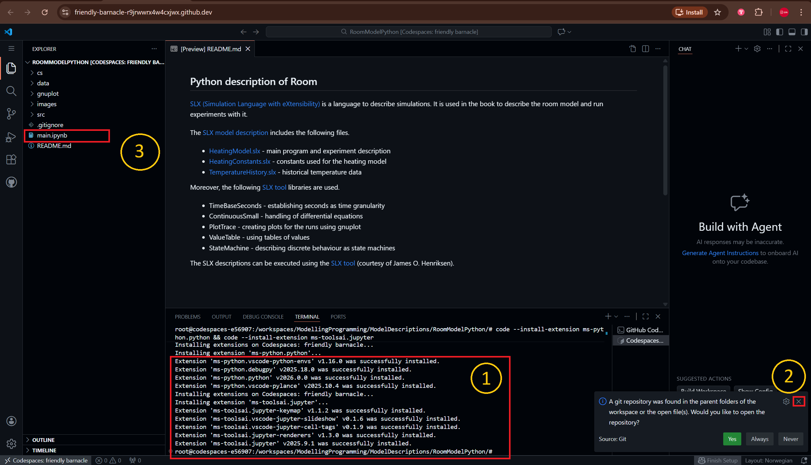
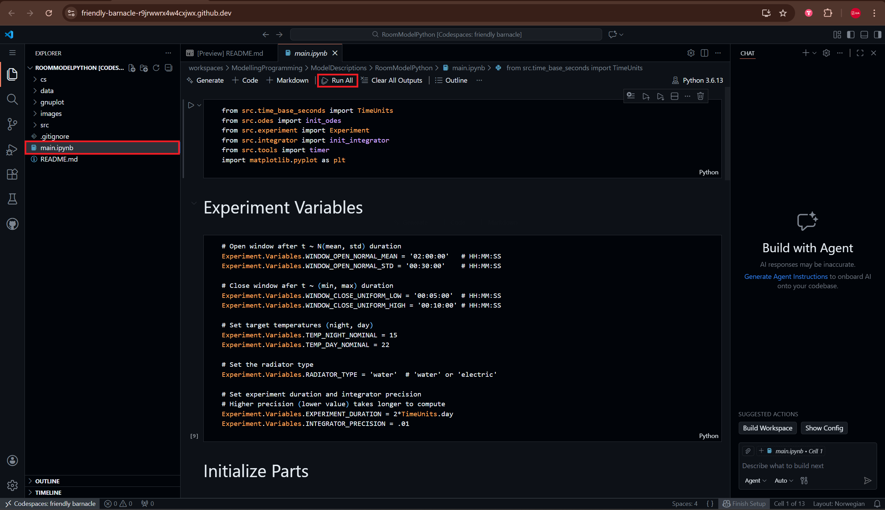

## Step 1: Click the "Code" button at the [repository home](https://github.com/PrinzAndreas/ModellingProgramming)

## Step 2: Select "Codespaces" and click the "Create codespace on main" button 

## Step 3: Wait for the codespace to build

## Step 4: Click the "main.ipynb" file
Once you see "Extension <...> was successfully installed" followed by "root@codespaces" as highlighted by (1) the codespace has finished building. 

Regarding (2) just cross it out, then open "main.ipynb" as highlighted by (3).

## Step 5: Click the "Run All" button

