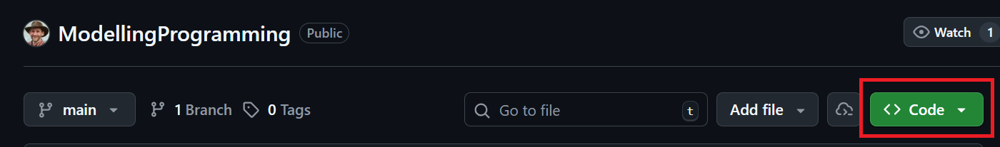
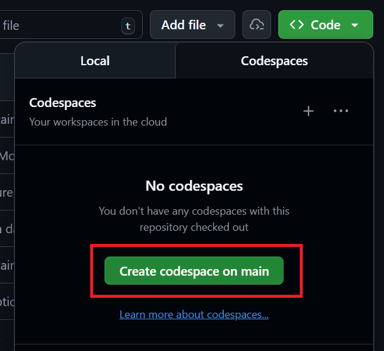
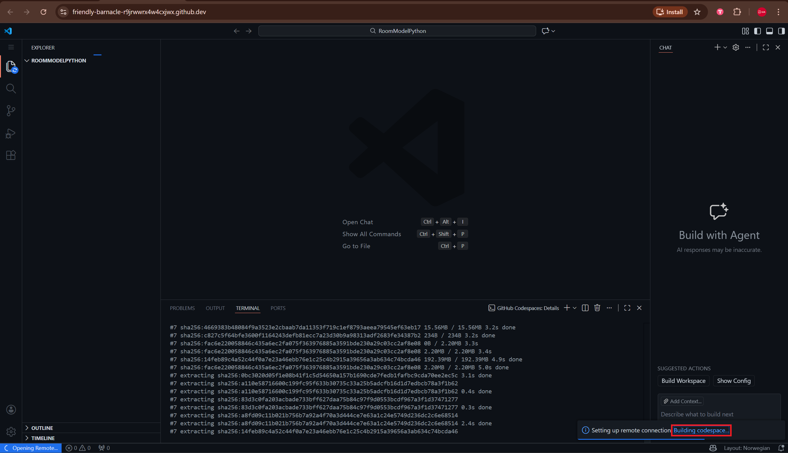
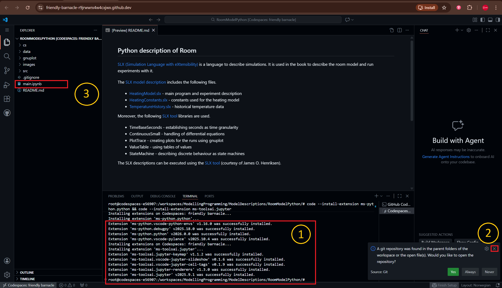
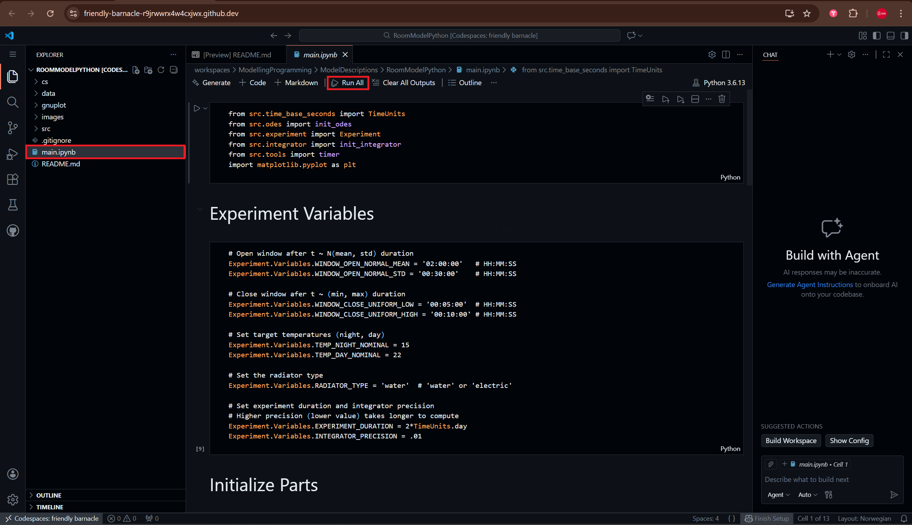

**Step 1: Click the "Code" button**

**Step 2: Click the "Create codespace on main" button** 

**Step 3: Wait for the codespace to build**

**Step 4: Click the "main.ipynb" file**  
Once you see "Extension <...> was successfully installed" followed by "root@codespaces" as highlighted by (1) the codespace has finished building. 

Regarding (2) just cross it out, then open "main.ipynb" as highlighted by (3)

**Step 5: Click the "Run All" button**

