## Partial SysML Description of the Room system

This page collects the SysML diagrams specifying the Room system in the book.
The diagrams are only a partial description of the system - we might in the future add more diagrams to cover the systems completely.

In addition, we have collected the SysML code examples use in the book.

### Collected SysML diagrams of the Room system
[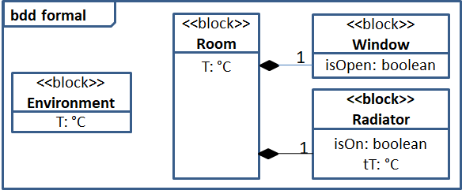](Figure_2_10.png)
[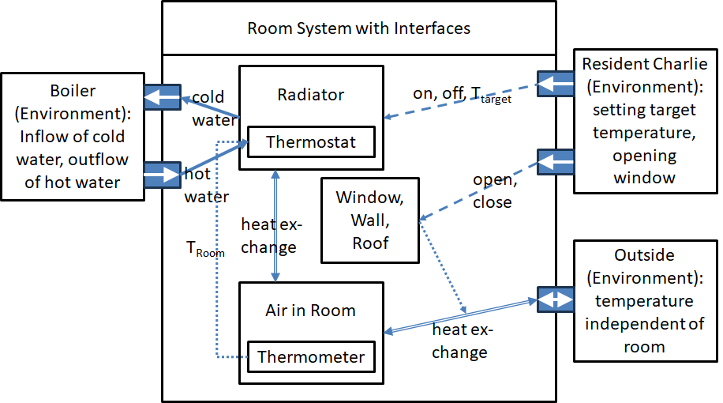](Figure_3_3.png)
[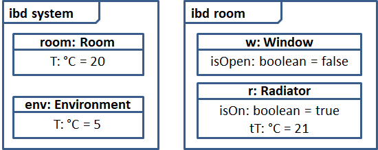](Figure_4_2.png)
[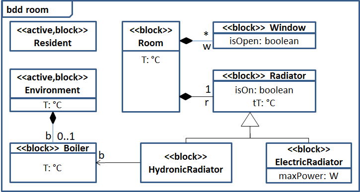](Figure_4_3.png)
[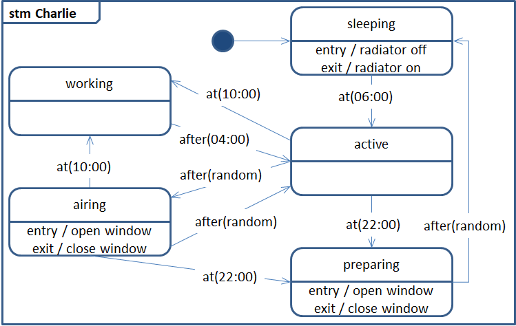](Figure_4_5.png)
[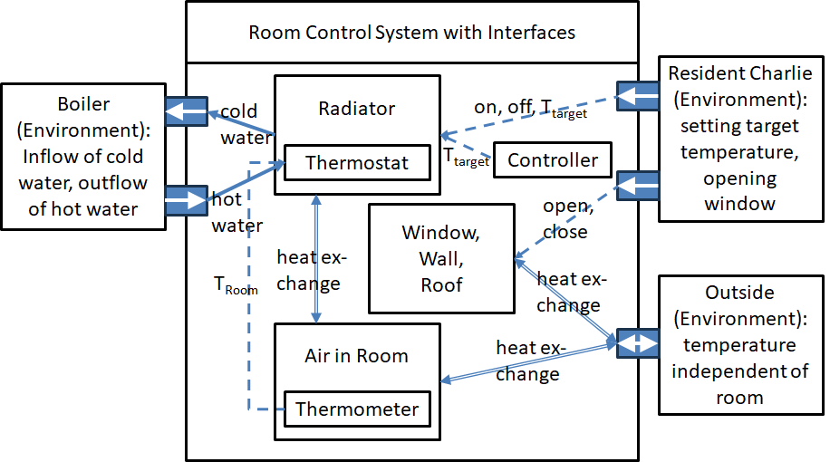](Figure_5_13.png)
[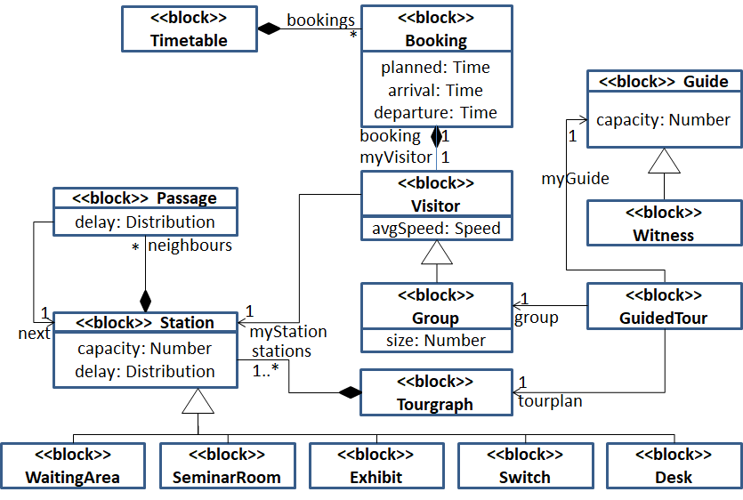](Figure_6_11.png)

### SysML code examples (diagrams) from the book
[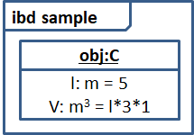](snapshot.png)
[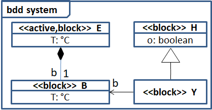](domain.png)
[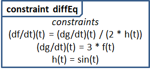](diffEq.png)
[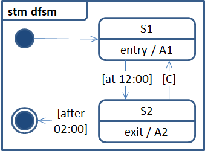](dfsm.png)
