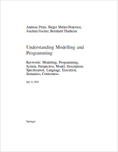

# Understanding Modelling and Programming
## Companion Material

Welcome to the online resources for the book *Understanding Modelling and Programming*

.

### Slides
* Slideset for book
* Slideset problem pictures
* Slideset book illustrations

### Illustrations
* Figures
* Drawings
* Diagrams

### Data
* Temperature Data
* Simulation data

### Teaching support
* Hints for exercise solutions

### Model descriptions
* [SLX Model Description](RoomModelSLX)
* Python Model Description
* SysML Model

