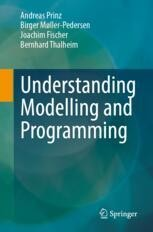

# Understanding Modelling and Programming
## Companion Material

Welcome to the online resources for the book [*Understanding Modelling and Programming*}(https://link.springer.com/book/9783031712791).

.

### [Model descriptions](ModelDescriptions)
* [SLX Model Description](ModelDescriptions/RoomModelSLX)
* [Python Model Description](ModelDescriptions/RoomModelPython)
* [SysML Model Description](ModelDescriptions/RoomModelSysML)

### [Data](Data)
* [Temperature Data](Data/TemperaturData)
* [Simulation Data](Data/SimulationData)

### [Illustrations](Illustrations)
* [Figures](Illustrations/Figures)
* [Drawings](Illustrations/Drawings)
* [Diagrams](Illustrations/Diagrams)

### [Teaching support](Teaching)
* [Hints for exercise solutions](Teaching/SolutionHints)
