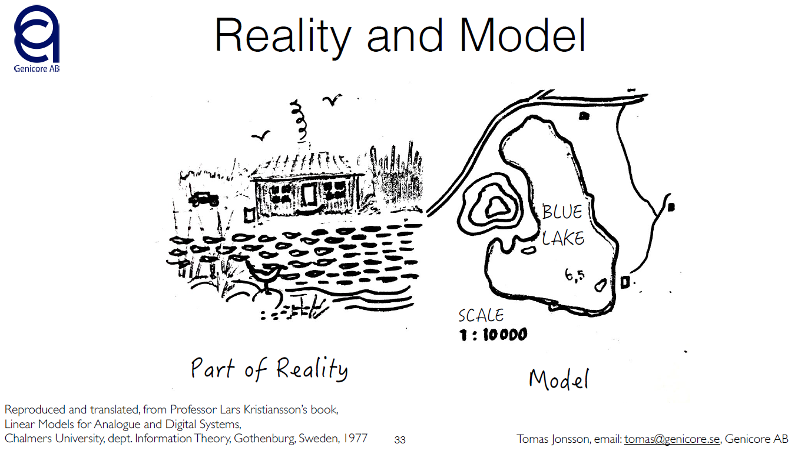
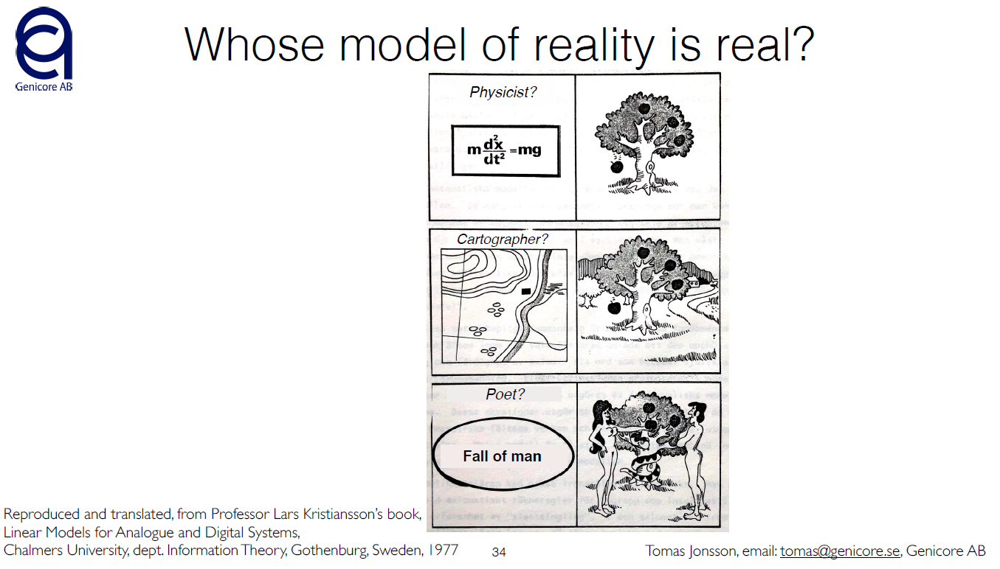
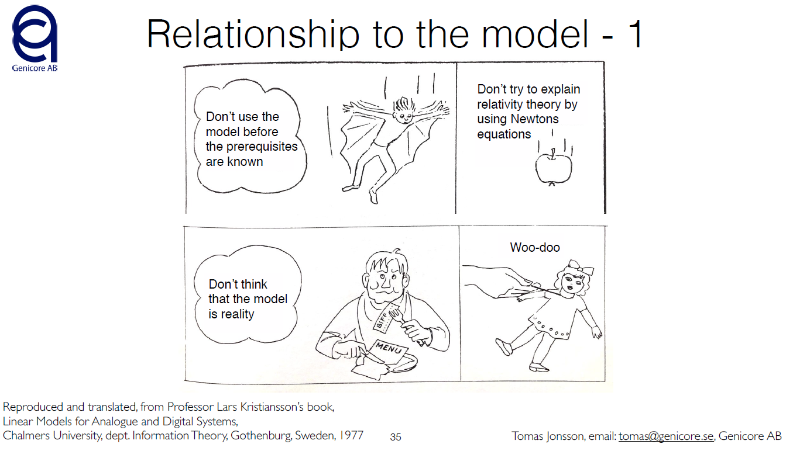
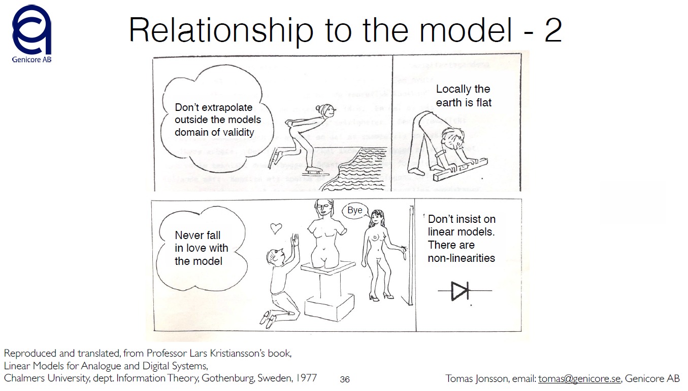
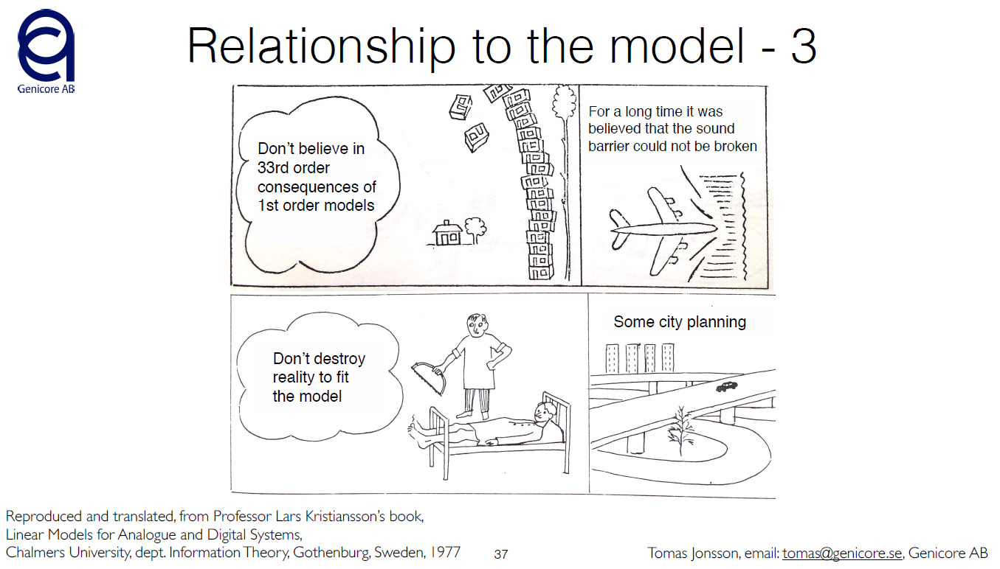
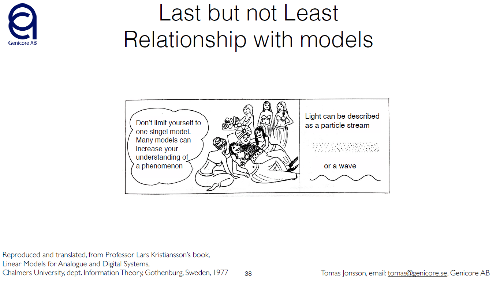

## Slides and Figures

* Work in progress  

### Figures about pitfalls of Modelling
The following figures are reproduced and translated by Tomas Jonsson from Professor Lars Kristiansson’s book,
[Linear Models for Analogue and Digital Systems](https://libris.kb.se/bib/493687),
Chalmers University, dept. Information Theory, Gothenburg, Sweden, 1977.

